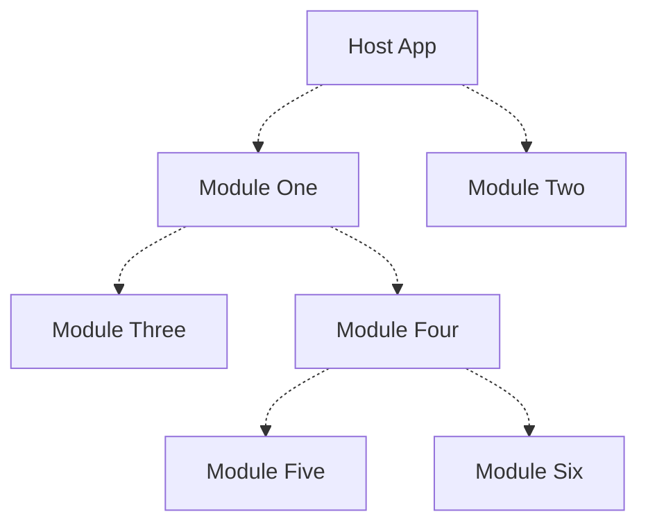

```mermaid
graph TB
  host[Host App]
  mod1[Module One]
  mod2[Module Two]
  host -.-> mod1
  host -.-> mod2
  mod3[Module Three]
  mod4[Module Four]
  mod5[Module Five]
  mod6[Module Six]
  mod1 -.-> mod3
  mod1 -.-> mod4
  mod4 -.-> mod5
  mod4 -.-> mod6
```